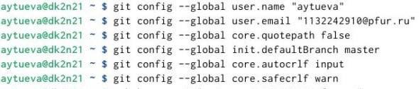
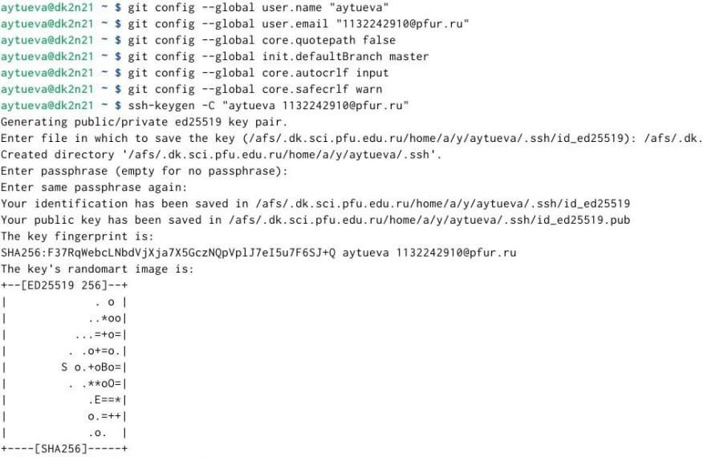
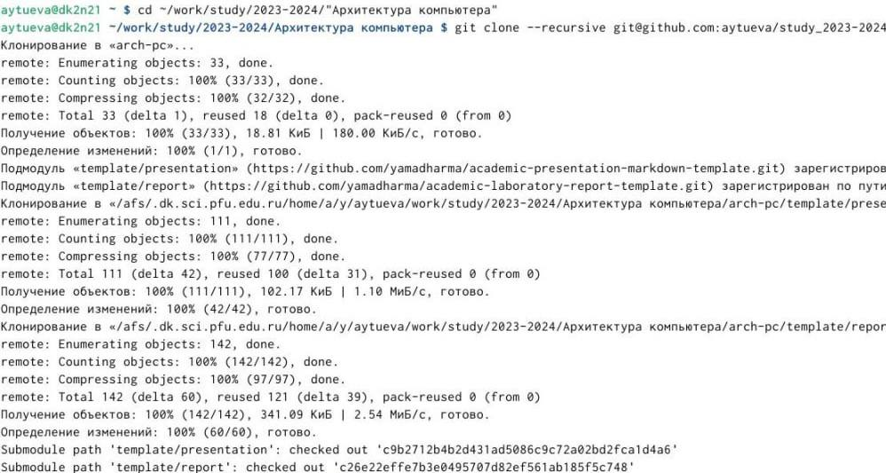
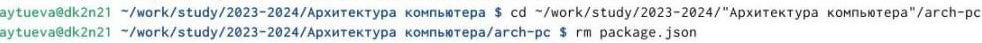
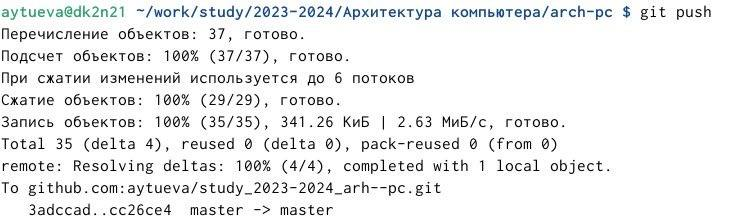
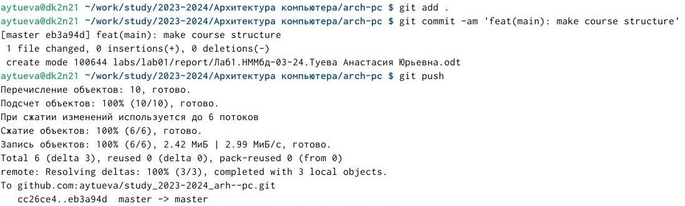
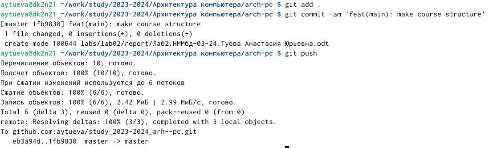

---
## Front matter
title: "Отчёт по лабораторной работе №2"
subtitle: "Архитектура компьютера НММбд-03-24"
author: "Туева Анастасия Юрьевна"

## Generic otions
lang: ru-RU
toc-title: "Содержание"

## Bibliography
bibliography: bib/cite.bib
csl: pandoc/csl/gost-r-7-0-5-2008-numeric.csl

## Pdf output format
toc: true # Table of contents
toc-depth: 2
lof: true # List of figures
lot: true # List of tables
fontsize: 12pt
linestretch: 1.5
papersize: a4
documentclass: scrreprt
## I18n polyglossia
polyglossia-lang:
  name: russian
  options:
	- spelling=modern
	- babelshorthands=true
polyglossia-otherlangs:
  name: english
## I18n babel
babel-lang: russian
babel-otherlangs: english
## Fonts
mainfont: IBM Plex Serif
romanfont: IBM Plex Serif
sansfont: IBM Plex Sans
monofont: IBM Plex Mono
mathfont: STIX Two Math
mainfontoptions: Ligatures=Common,Ligatures=TeX,Scale=0.94
romanfontoptions: Ligatures=Common,Ligatures=TeX,Scale=0.94
sansfontoptions: Ligatures=Common,Ligatures=TeX,Scale=MatchLowercase,Scale=0.94
monofontoptions: Scale=MatchLowercase,Scale=0.94,FakeStretch=0.9
mathfontoptions:
## Biblatex
biblatex: true
biblio-style: "gost-numeric"
biblatexoptions:
  - parentracker=true
  - backend=biber
  - hyperref=auto
  - language=auto
  - autolang=other*
  - citestyle=gost-numeric
## Pandoc-crossref LaTeX customization
figureTitle: "Рис."
tableTitle: "Таблица"
listingTitle: "Листинг"
lofTitle: "Список иллюстраций"
lotTitle: "Список таблиц"
lolTitle: "Листинги"
## Misc options
indent: true
header-includes:
  - \usepackage{indentfirst}
  - \usepackage{float} # keep figures where there are in the text
  - \floatplacement{figure}{H} # keep figures where there are in the text
---

# Цель работы

Целью данной работы является изучить идеологию и применение средств контроля версий. Приобрести практические навыки по работе с системой git.

# Выполнение лабораторной работы

Сначала нам нужно создать аккаунт на github и настроить его. (рис. [-@fig:001]).

{ #fig:001 width=70% }

Для последующей идентификации пользователя на сервере репозиториев необходимо сгенерировать пару ключей. (рис. [-@fig:002]).

{ #fig:002 width=70% }

Теперь мы можем создать репозиторий и клонировать его с помощью github. (рис. [-@fig:003]).

{ #fig:003 width=70% }

Также нам нужно настроить каталог курса, удалить ненужные файлы и создать необходимые каталоги (рис. [-@fig:004]). 

{ #fig:004 width=70% }

Отправим все изменения на github (рис. [-@fig:005]). 

{ #fig:005 width=70% }

# Выполнение самостоятельной работы

Чтобы сохранить все отчёты на github, нам нужно сначала добавить файлы с отчётами в соответствующие каталоги, которые мы создали в ходе выполнения этой лабораторной работы.
Используя изученные команды мы можем загрузить все отчёты на github (рис. [-@fig:006]).

{ #fig:006 width=70% }

Проделываем всё тоже самое с отчётом по Лабораторной №2 (рис. [-@fig:007]).

{ #fig:007 width=70% }

# Выводы

Я изучила идеологию и применение средств контроля версий и приобрела практические навыки по работе с системой git.
