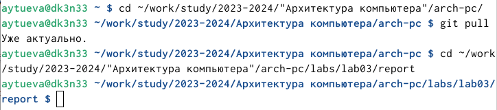
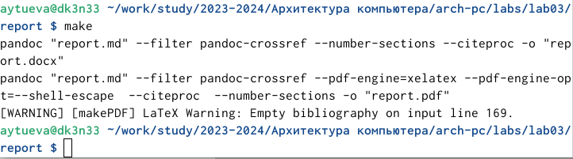
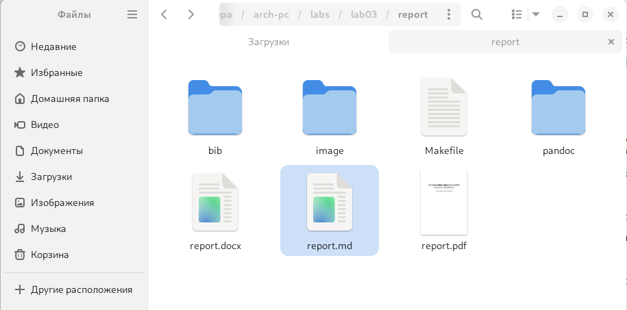
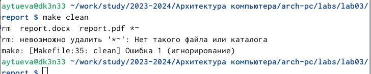
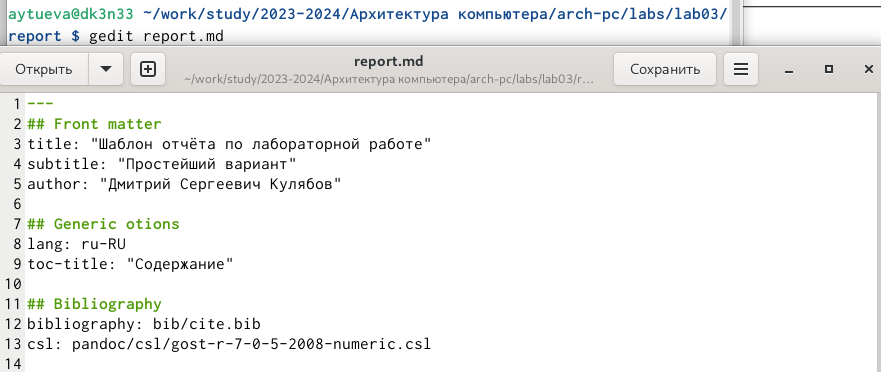
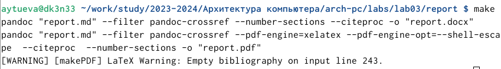
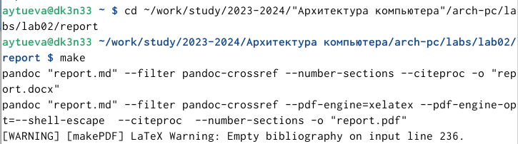
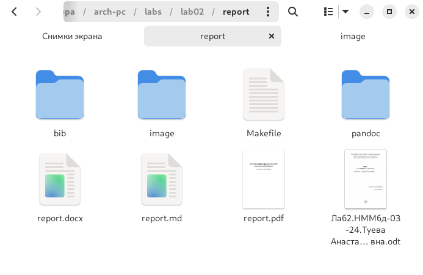
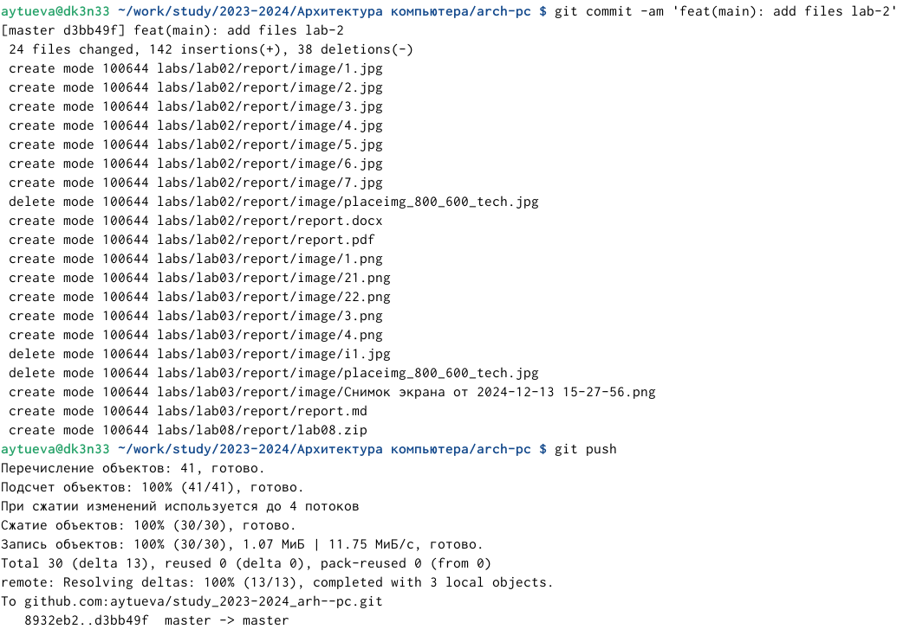

---
## Front matter
title: "Отчёт по лабораторной работе №3"
subtitle: "Архитектура компьютера НММбд-03-24"
author: "Туева Анастасия Юрьевна"

## Generic otions
lang: ru-RU
toc-title: "Содержание"

## Bibliography
bibliography: bib/cite.bib
csl: pandoc/csl/gost-r-7-0-5-2008-numeric.csl

## Pdf output format
toc: true # Table of contents
toc-depth: 2
lof: true # List of figures
lot: true # List of tables
fontsize: 12pt
linestretch: 1.5
papersize: a4
documentclass: scrreprt
## I18n polyglossia
polyglossia-lang:
  name: russian
  options:
	- spelling=modern
	- babelshorthands=true
polyglossia-otherlangs:
  name: english
## I18n babel
babel-lang: russian
babel-otherlangs: english
## Fonts
mainfont: IBM Plex Serif
romanfont: IBM Plex Serif
sansfont: IBM Plex Sans
monofont: IBM Plex Mono
mathfont: STIX Two Math
mainfontoptions: Ligatures=Common,Ligatures=TeX,Scale=0.94
romanfontoptions: Ligatures=Common,Ligatures=TeX,Scale=0.94
sansfontoptions: Ligatures=Common,Ligatures=TeX,Scale=MatchLowercase,Scale=0.94
monofontoptions: Scale=MatchLowercase,Scale=0.94,FakeStretch=0.9
mathfontoptions:
## Biblatex
biblatex: true
biblio-style: "gost-numeric"
biblatexoptions:
  - parentracker=true
  - backend=biber
  - hyperref=auto
  - language=auto
  - autolang=other*
  - citestyle=gost-numeric
## Pandoc-crossref LaTeX customization
figureTitle: "Рис."
tableTitle: "Таблица"
listingTitle: "Листинг"
lofTitle: "Список иллюстраций"
lotTitle: "Список таблиц"
lolTitle: "Листинги"
## Misc options
indent: true
header-includes:
  - \usepackage{indentfirst}
  - \usepackage{float} # keep figures where there are in the text
  - \floatplacement{figure}{H} # keep figures where there are in the text
---

# Цель работы

Целью работы является освоение процедуры оформления отчетов с помощью легковесного языка разметки Markdown.

# Выполнение лабораторной работы

Открываем терминал, переходим в каталог курса, сформированный при выполнении лабораторной работы №2. Обновляем локальный репозиторий с помощью команды git pull. Переходим в каталог с шаблоном отчета по лабораторной работе №3 (рис. [-@fig:001]).

{ #fig:001 width=70% }

Проведём компиляцию шаблона с использованием Makefile. Для этого введём команду "make" (рис. [-@fig:021]).

{ #fig:021 width=70% }

Сгенерировались файлы report.pdf и report.docx. Я открыла и проверила корректность полученных файлов. (рис. [-@fig:022]).

{ #fig:022 width=70% }

Удалим полученный файлы с использованием Makefile. Для этого введём команду make clean (рис. [-@fig:003]).

{ #fig:003 width=70% }

Откроем файл report.md c помощью любого текстового редактора, например gedit (рис. [-@fig:004]). 

{ #fig:004 width=70% }

Заполним и скомпилируем отчет с использованием Makefile. (рис. [-@fig:005]). 

{ #fig:005 width=70% }

Загрузим файлы на Github. 

# Выполнение самостоятельной работы

Сделаем отчёт по лабораторной работе № 2 в формате Markdown. (рис. [-@fig:061]).

{ #fig:061 width=70% }

{ #fig:062 width=70% }

Загрузим файлы на github (рис. [-@fig:007]).

{ #fig:007 width=70% }

# Выводы

Я изучила идеологию и применение средств контроля версий и приобрела практические навыки по работе с системой git.
