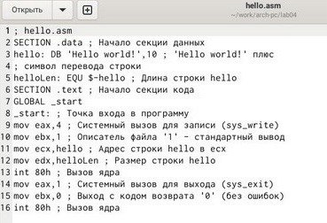
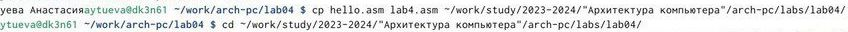

---
## Front matter
title: "Отчёт по лабораторной работе №4"
subtitle: "Архитектура компьютера НММбд-03-24"
author: "Туева Анастасия Юрьевна"

## Generic otions
lang: ru-RU
toc-title: "Содержание"

## Bibliography
bibliography: bib/cite.bib
csl: pandoc/csl/gost-r-7-0-5-2008-numeric.csl

## Pdf output format
toc: true # Table of contents
toc-depth: 2
lof: true # List of figures
lot: true # List of tables
fontsize: 12pt
linestretch: 1.5
papersize: a4
documentclass: scrreprt
## I18n polyglossia
polyglossia-lang:
  name: russian
  options:
	- spelling=modern
	- babelshorthands=true
polyglossia-otherlangs:
  name: english
## I18n babel
babel-lang: russian
babel-otherlangs: english
## Fonts
mainfont: IBM Plex Serif
romanfont: IBM Plex Serif
sansfont: IBM Plex Sans
monofont: IBM Plex Mono
mathfont: STIX Two Math
mainfontoptions: Ligatures=Common,Ligatures=TeX,Scale=0.94
romanfontoptions: Ligatures=Common,Ligatures=TeX,Scale=0.94
sansfontoptions: Ligatures=Common,Ligatures=TeX,Scale=MatchLowercase,Scale=0.94
monofontoptions: Scale=MatchLowercase,Scale=0.94,FakeStretch=0.9
mathfontoptions:
## Biblatex
biblatex: true
biblio-style: "gost-numeric"
biblatexoptions:
  - parentracker=true
  - backend=biber
  - hyperref=auto
  - language=auto
  - autolang=other*
  - citestyle=gost-numeric
## Pandoc-crossref LaTeX customization
figureTitle: "Рис."
tableTitle: "Таблица"
listingTitle: "Листинг"
lofTitle: "Список иллюстраций"
lotTitle: "Список таблиц"
lolTitle: "Листинги"
## Misc options
indent: true
header-includes:
  - \usepackage{indentfirst}
  - \usepackage{float} # keep figures where there are in the text
  - \floatplacement{figure}{H} # keep figures where there are in the text
---

# Цель работы

Освоить процедуры компиляции и сборки программ, написанных на ассемблере NASM.

# Задание

1. Изучить основные принцыпи работы языка Ассемлера.
2. Выполнение лабораторной работы.
3. Выполнение самостоятельной работы.

# Выполнение лабораторной работы

Описываются проведённые действия, в качестве иллюстрации даётся ссылка на иллюстрацию (рис. [-@fig:001]).

1. Создаём каталог для работы с программами на языке ассемблера NASM и переходим в него. Создадим текстовый файл "hello.asm" и откроем.
{#fig:001 width=70%}

2. Введём в него данный текст.
{#fig:001 width=70%}

3.1. Скомпилируем и проверим наличе объектного файла. 
3.2. Скомпилируем исходный файл hello.asm в obj.o, также проверим наличие файлов. 
3.3. Объектный файл необходимо передать на обработку компоновщику. Проверим, что исполняемый файл был создан. 
3.4. Запустим на выполнение созданный исполняемый файл
{#fig:001 width=70%}

# Выполнение самостоятельной работы 

1. Создадим копию файла hello.asm с именем lab4.asm.
{#fig:001 width=70%}

2. Внесём изменения в текст программы так, чтобы вместо "Hello world!" на экран выводилась строка с моими фамилией и именем.
{#fig:001 width=70%}

3. Оттранслируем полученный текст программы lab4.asm в объектный файл. Скомпонируем объектный файл и запустим получившийся исполняемый файл.
{#fig:001 width=70%}

4. Создадим копию файла lab04.asm.
{#fig:001 width=70%}

5. Отправляем файлы на Github.
{#fig:001 width=70%}

# Выводы

Благодаря этой лабораторной работе, я освоила процедуры компиляции и сборки программ, написанных на ассемблере NASM.

