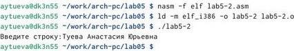
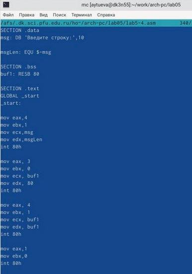

---
## Front matter
title: "Отчёт по лабораторной работе №5"
subtitle: "Архитектура компьютера НММбд-03-24"
author: "Туева Анастасия Юрьевна"

## Generic otions
lang: ru-RU
toc-title: "Содержание"

## Bibliography
bibliography: bib/cite.bib
csl: pandoc/csl/gost-r-7-0-5-2008-numeric.csl

## Pdf output format
toc: true # Table of contents
toc-depth: 2
lof: true # List of figures
lot: true # List of tables
fontsize: 12pt
linestretch: 1.5
papersize: a4
documentclass: scrreprt
## I18n polyglossia
polyglossia-lang:
  name: russian
  options:
	- spelling=modern
	- babelshorthands=true
polyglossia-otherlangs:
  name: english
## I18n babel
babel-lang: russian
babel-otherlangs: english
## Fonts
mainfont: IBM Plex Serif
romanfont: IBM Plex Serif
sansfont: IBM Plex Sans
monofont: IBM Plex Mono
mathfont: STIX Two Math
mainfontoptions: Ligatures=Common,Ligatures=TeX,Scale=0.94
romanfontoptions: Ligatures=Common,Ligatures=TeX,Scale=0.94
sansfontoptions: Ligatures=Common,Ligatures=TeX,Scale=MatchLowercase,Scale=0.94
monofontoptions: Scale=MatchLowercase,Scale=0.94,FakeStretch=0.9
mathfontoptions:
## Biblatex
biblatex: true
biblio-style: "gost-numeric"
biblatexoptions:
  - parentracker=true
  - backend=biber
  - hyperref=auto
  - language=auto
  - autolang=other*
  - citestyle=gost-numeric
## Pandoc-crossref LaTeX customization
figureTitle: "Рис."
tableTitle: "Таблица"
listingTitle: "Листинг"
lofTitle: "Список иллюстраций"
lotTitle: "Список таблиц"
lolTitle: "Листинги"
## Misc options
indent: true
header-includes:
  - \usepackage{indentfirst}
  - \usepackage{float} # keep figures where there are in the text
  - \floatplacement{figure}{H} # keep figures where there are in the text
---

# Цель работы

Научться работать в Midnight Commander и освоить инструкции языка ассемблера mov и int.

# Задание

1. Изучить основы работы с Midnight Commander и освоить язык ассемблера.
2. Выполнение лабораторной работы.
3. Выполнение самостоятельной работы.

# Выполнение лабораторной работы

Описываются проведённые действия, в качестве иллюстрации даётся ссылка на иллюстрацию (рис. [-@fig:001]).

1. Откроем Midnight Commander при помощи команды "mc".
{#fig:001 width=70%}

2. Создадим папку "lab05" с помощью функциональной клавиши "F7" перейдём в созданный каталог.
{#fig:001 width=70%}

3. Пользуясь строкой ввода и командой "touch", создадим файл "lab5-1.asm". 
{#fig:001 width=70%}

4. С помощью клавиши "F4" откроем файл "lab5-1.asm" для редактирования во встроенном редакторе и введём текст программы из данного нам листинга. 
{#fig:001 width=70%}

5. Оттранслируем текст программы "lab5-1.asm" в объектный файл, выполним компоновку объектного файла и запустим получившийся исполняемый файл.
{#fig:001 width=70%}

6. Скачаем файл "in_out.asm" со страницы курса в ТУИС и копируем его в каталог с файлом "lab5-1.asm".
{#fig:001 width=70%}

7. Создание копии файла "lab5-1.asm" с именем "lab5-2.asm" с помощью функциональной клавиши "F6".
{#fig:001 width=70%}

8. Исправляем текст программы в файле "lab5-2.asm" с использование подпрограмм из
внешнего файла "in_out.asm". 
{#fig:001 width=70%}

9. Создаём исполняемый файл и проверяем его работу.
{#fig:001 width=70%}

10. Изменим подпрограмму "sprintLF" на "sprint".
{#fig:001 width=70%}

11. Создадим исполняемый файл и проверим его работу. При изменении подпрограммы ввод с клавиатуры будет осуществляться не со следующей строки, а на той же.
{#fig:001 width=70%}

# Выполнение самостоятельной работы 

1. Создание копии файла "lab5-2.asm" с именем "lab5-3.asm". Редактируем программу, чтобы файл выводил введённую строку на экран.
{#fig:001 width=70%}

2. Создаём исполняемый файл и проверяем его работу.
{#fig:001 width=70%}

3. Создаём копию файла "lab5-1.asm" с именем "lab5-4.asm" и редактируем программу.
{#fig:001 width=70%}

4. Создаём исполняемый файл и проверяем его работу.
{#fig:001 width=70%}

# Выводы

Благодаря данной лабораторной работе я научилась работать в Midnight Commander и освоила инструкции языка ассемблера mov и int.

