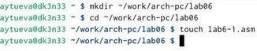
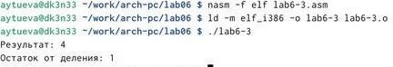

---
## Front matter
title: "Отчёт по лабораторной работе №6"
subtitle: "Архитектура компьютера НММбд-03-24"
author: "Туева Анастасия Юрьевна"

## Generic otions
lang: ru-RU
toc-title: "Содержание"

## Bibliography
bibliography: bib/cite.bib
csl: pandoc/csl/gost-r-7-0-5-2008-numeric.csl

## Pdf output format
toc: true # Table of contents
toc-depth: 2
lof: true # List of figures
lot: true # List of tables
fontsize: 12pt
linestretch: 1.5
papersize: a4
documentclass: scrreprt
## I18n polyglossia
polyglossia-lang:
  name: russian
  options:
	- spelling=modern
	- babelshorthands=true
polyglossia-otherlangs:
  name: english
## I18n babel
babel-lang: russian
babel-otherlangs: english
## Fonts
mainfont: IBM Plex Serif
romanfont: IBM Plex Serif
sansfont: IBM Plex Sans
monofont: IBM Plex Mono
mathfont: STIX Two Math
mainfontoptions: Ligatures=Common,Ligatures=TeX,Scale=0.94
romanfontoptions: Ligatures=Common,Ligatures=TeX,Scale=0.94
sansfontoptions: Ligatures=Common,Ligatures=TeX,Scale=MatchLowercase,Scale=0.94
monofontoptions: Scale=MatchLowercase,Scale=0.94,FakeStretch=0.9
mathfontoptions:
## Biblatex
biblatex: true
biblio-style: "gost-numeric"
biblatexoptions:
  - parentracker=true
  - backend=biber
  - hyperref=auto
  - language=auto
  - autolang=other*
  - citestyle=gost-numeric
## Pandoc-crossref LaTeX customization
figureTitle: "Рис."
tableTitle: "Таблица"
listingTitle: "Листинг"
lofTitle: "Список иллюстраций"
lotTitle: "Список таблиц"
lolTitle: "Листинги"
## Misc options
indent: true
header-includes:
  - \usepackage{indentfirst}
  - \usepackage{float} # keep figures where there are in the text
  - \floatplacement{figure}{H} # keep figures where there are in the text
---

# Цель работы
Цель данной лабораторной работы - освоить арифметческие инструкции языка ассемблера NASM.

# Задание

1. Символьные и численные данные в NASM
2. Выполнение арифметических операций в NASM
3. Выполнение заданий для самостоятельной работы

# Выполнение лабораторной работы

1. Символьные и численные данные в NASM

С помощью команды "touch" создаю файл "lab6-1.asm" (рис. [-@fig:001]).

{ #fig:001 width=70% }

Открываем созданный файл lab6-1.asm, вставляем в него программу вывода значения регистра "eax" (рис. [-@fig:002]).

{ #fig:002 width=70% }

Создаем исполняемый файл программы и запускаем его (рис. [-@fig:003]). Программа выводит символ j, потому что программа вывела символ, соответствующий по системе ASCII сумме двоичных кодов символов 4 и 6.

{ #fig:003 width=70% }

Изменяем в тексте программы символы "6" и "4" на цифры 6 и 4 (рис. [-@fig:004]). 

{ #fig:004 width=70% }

Создаем новый исполняемый файл программы и запускаем его (рис. [-@fig:005]). Теперь вывелся символ с кодом 10, это символ перевода строки. Этот символ не отображается при выводе на экран.

{ #fig:005 width=70% }

Создаем новый файл lab6-2.asm с помощью команды "touch".

Вводим в файл текст другой программы для вывода значения регистра "eax" (рис. [-@fig:006]).

{ #fig:006 width=70% }

Создаем и запускаем исполняемый файл "lab6-2" (рис. [-@fig:007]). Теперь выводится число 106.

{ #fig:007 width=70% }

Заменяем в тексте программы в файле "lab6-2.asm" символы "6" и "4" на числа 6 и 4 (рис. [-@fig:008]).

{ #fig:008 width=70% }

Создаем и запускаем новый исполняемый файл (рис. [-@fig:009]).. Теперь программа складывает не соответствующие символам коды в системе ASCII, а сами числа, поэтому выводится 10.

{ #fig:009 width=70% }

Заменяем в тексте программы функцию "iprintLF" на "iprint" (рис. [-@fig:010]).

{ #fig:010 width=70% }

Создаем и запускам новый исполняемый файл (рис. [-@fig:011]). Вывод не изменился.

{ #fig:011 width=70% }

2. Выполнение арифметических операций в NASM

Создаем файл "lab6-3.asm" с помощью команды "touch" (рис. [-@fig:012]).

{ #fig:012 width=70% }

Вводим в созданный файл текст программы для вычисления значения выражения "f(x) = (5 * 2 + 3)/3" (рис. [-@fig:013]).

{ #fig:013 width=70% }

Создаем исполняемый файл и запускаю его (рис. [-@fig:014]).

{ #fig:014 width=70% }

Изменяем программу так, чтобы она вычисляла значение выражения "f(x) = (4 * 6 + 2)/5" (рис. [-@fig:015]). 

{ #fig:015 width=70% }

Создаем и запускаю новый исполняемый файл (рис. [-@fig:016]).

{ #fig:016 width=70% }

Создаем файл "variant.asm" с помощью команды "touch" (рис. [-@fig:017]).

{ #fig:017 width=70% }

Вводим в файл текст программы для вычисления варианта задания по номеру студенческого билета (рис. [-@fig:018]).

{ #fig:018 width=70% }

Создаем и запускаем исполняемый файл (рис. [-@fig:019]). Вводим номер своего студенческого билета с клавиатуры, программа выводит, что мой вариант - 11.

{ #fig:019 width=70% }

1. За вывод сообщения "Ваш вариант" отвечают строки кода:

mov eax,rem
call sprint

2. Инструкция "mov ecx, x" используется, чтобы положить адрес вводимой строки x в регистр "ecx"
"mov edx, 80" - запись в регистр "edx" длины вводимой строки 
"call sread" - вызов подпрограммы из внешнего файла, обеспечивающей ввод сообщения с клавиатуры.

3. "call atoi" используется для вызова подпрограммы из внешнего файла, которая преобразует ascii-код символа в целое число и записывает результат в регистр "eax"

4. За вычисления варианта отвечают строки:

xor edx,edx ; обнуление edx для корректной работы div
mov ebx,20 ; ebx = 20
div ebx ; eax = eax/20, edx - остаток от деления
inc edx ; edx = edx + 1

5. При выполнении инструкции "div ebx" остаток от деления записывается в регистр "edx".

6. Инструкция "inc edx" увеличивает значение регистра "edx" на 1

7. За вывод на экран результатов вычислений отвечают строки:

mov eax,edx
call iprintLF

# Выполнение самостоятельной работы

Создаем файл "lab6-4.asm" с помощью команды "touch" (рис. [-@fig:020]).

{ #fig:020 width=70% }

Открываем созданный файл для редактирования, вводим в него текст программы для вычисления значения выражения "10 * (x + 1) - 10" (рис. [-@fig:021]). Это выражение было под вариантом 11.

{ #fig:021 width=70% }

Создаем и запускаем исполняемый файл (рис. [-@fig:022]). При вводе значения 1, вывод - 10, а при вводе значения 7, вывод - 70.

{ #fig:022 width=70% }

# Выводы

При выполнении данной лабораторной работы я освоила арифметические инструкции языка ассемблера NASM.
