---
## Front matter
title: "Отчёт по лабораторной работе №7"
subtitle: "Архитектура компьютера НММбд-03-24"
author: "Туева Анастасия Юрьевна"

## Generic otions
lang: ru-RU
toc-title: "Содержание"

## Bibliography
bibliography: bib/cite.bib
csl: pandoc/csl/gost-r-7-0-5-2008-numeric.csl

## Pdf output format
toc: true # Table of contents
toc-depth: 2
lof: true # List of figures
lot: true # List of tables
fontsize: 12pt
linestretch: 1.5
papersize: a4
documentclass: scrreprt
## I18n polyglossia
polyglossia-lang:
  name: russian
  options:
	- spelling=modern
	- babelshorthands=true
polyglossia-otherlangs:
  name: english
## I18n babel
babel-lang: russian
babel-otherlangs: english
## Fonts
mainfont: IBM Plex Serif
romanfont: IBM Plex Serif
sansfont: IBM Plex Sans
monofont: IBM Plex Mono
mathfont: STIX Two Math
mainfontoptions: Ligatures=Common,Ligatures=TeX,Scale=0.94
romanfontoptions: Ligatures=Common,Ligatures=TeX,Scale=0.94
sansfontoptions: Ligatures=Common,Ligatures=TeX,Scale=MatchLowercase,Scale=0.94
monofontoptions: Scale=MatchLowercase,Scale=0.94,FakeStretch=0.9
mathfontoptions:
## Biblatex
biblatex: true
biblio-style: "gost-numeric"
biblatexoptions:
  - parentracker=true
  - backend=biber
  - hyperref=auto
  - language=auto
  - autolang=other*
  - citestyle=gost-numeric
## Pandoc-crossref LaTeX customization
figureTitle: "Рис."
tableTitle: "Таблица"
listingTitle: "Листинг"
lofTitle: "Список иллюстраций"
lotTitle: "Список таблиц"
lolTitle: "Листинги"
## Misc options
indent: true
header-includes:
  - \usepackage{indentfirst}
  - \usepackage{float} # keep figures where there are in the text
  - \floatplacement{figure}{H} # keep figures where there are in the text
---

# Цель работы
Изучение команд условного и безусловного переходов, приобретение навыков написания программ с использованием переходов и знакомство с назначением и структурой файла листинга.

# Задание

1. Изучение команд условного и безусловного переходов
2. Выполнение лабораторной работы 
3. Выполнение самостоятельной работы

# Выполнение лабораторной работы

Создаём каталог для программам лабораторной работы № 7, переходим в него и создаём файл "lab7-1.asm" (рис. [-@fig:001]).

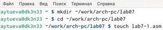{ #fig:001 width=70% }

Открываем созданный файл "lab7-1.asm", вставляем в него данный текст в соответствием с листингом 7.1. (рис. [-@fig:002]).

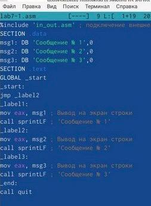{ #fig:002 width=70% }

Создаем исполняемый файл программы и запускаем его (рис. [-@fig:003]).

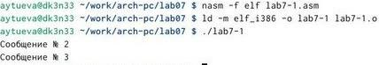{ #fig:003 width=70% }

Изменяем в текст программы в соответствии с листингом 7.2. (рис. [-@fig:004]). 

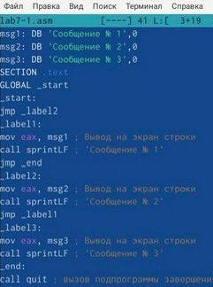{ #fig:004 width=70% }

Создаем новый исполняемый файл программы и запускаем его (рис. [-@fig:005]). 

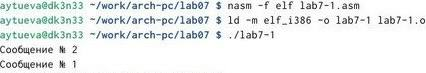{ #fig:005 width=70% }

Вводим в файл текст программы так, чтобы вывод программы был как в задании (рис. [-@fig:006]).

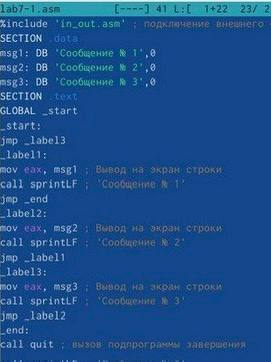{ #fig:006 width=70% }

Создаем новый исполняемый файл программы и запускаем его (рис. [-@fig:007]).

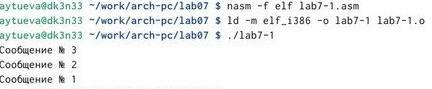{ #fig:007 width=70% }

Создаем новый файл lab7-2.asm с помощью команды "touch".

Вводим в файл текст другой программы в соответствии с листингом 7.3. (рис. [-@fig:008]).

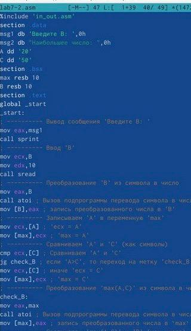{ #fig:008 width=70% }

Создаем исполняемый файл программы и запускаем его. Для проверки работы программы я ввела 3 разных числа (рис. [-@fig:009]).

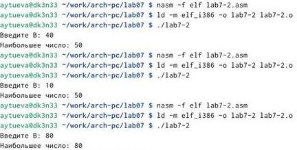{ #fig:009 width=70% }

Создадим файл листинга для программы из файла "lab7-2.asm" и откроем его с помощью любого текстового редактора, например "mcedit" (рис. [-@fig:010]).

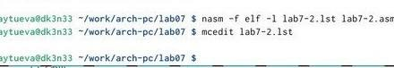{ #fig:010 width=70% }

Проанализировав файл, я поняла как он работает и какие значения выводит.

Эта строка находится на 21 месте, ее адрес "00000101", Машинный код - "В8 [0A000000]", а "mov eax,B" - исходный текст программы, означающий что в регистр "eax" мы вносим значения переменной B. (рис. [-@fig:011]).

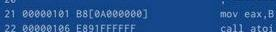{ #fig:011 width=70% }

Эта строка находится на 35 месте, ее адрес "00000135", Машинный код - "E862FFFFFF", а "call atoi" - исходный текст программы, означающий что символ лежащий в строке выше переводится в число. (рис. [-@fig:012]).

{ #fig:012 width=70% }

Эта строка находится на 47 месте, ее адрес "00000163", Машинный код - "A1[00000000]", а "mov eax,[max]" - исходный текст программы, означающий что число хранившееся в переменной "max" записывается в регистр "eax". (рис. [-@fig:013]).

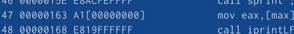{ #fig:013 width=70% }

В строке "mov eax,max" я убрала "max" и попробовала создать файл. Выдало ошибку, так как для программы нужно два операнда. (рис. [-@fig:014]).

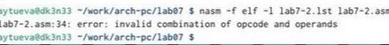{ #fig:014 width=70% }

В файле листинга показывает, где именно ошибка и с чем она связана.(рис. [-@fig:015]). 

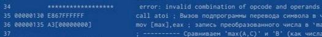{ #fig:015 width=70% }

# Выполнение самостоятельной работы

Создаем новый файл lab7-3.asm с помощью команды "touch".

Напишем программу нахождения наименьшей из 3 целочисленных переменных a, b и c. Мой вариант - 11. (рис. [-@fig:016]).

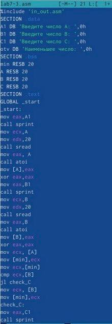{ #fig:016 width=70% }

Создаем исполняемый файл программы и запускаем его. Ответ верный.(рис. [-@fig:017]).

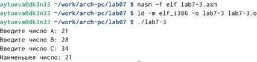{ #fig:017 width=70% }

Создаем новый файл lab7-4.asm с помощью команды "touch".

Во втором номере необходимо написать программу, которая для введенных с клавиатуры значений x и a вычисляет значение заданной функции f(x) и выводит результат вычислений. (рис. [-@fig:018]).

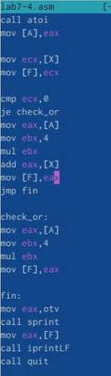{ #fig:018 width=70% }

Создаем и запускаем исполняемый файл. Ответы верны. (рис. [-@fig:019]).

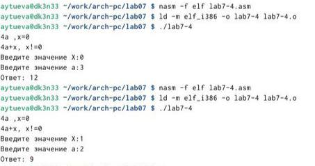{ #fig:019 width=70% }

# Выводы

Благодаря данной лабораторной работе я изучила команды условного и безусловного переходов, приобрела навыки написания программ с использованием переходов и познакомилась с назначением и структурой файла листинга.
