---
## Front matter
title: "Отчёт по лабораторной работе №9"
subtitle: "Архитектура компьютера НММбд-03-24"
author: "Туева Анастасия Юрьевна"

## Generic otions
lang: ru-RU
toc-title: "Содержание"

## Bibliography
bibliography: bib/cite.bib
csl: pandoc/csl/gost-r-7-0-5-2008-numeric.csl

## Pdf output format
toc: true # Table of contents
toc-depth: 2
lof: true # List of figures
lot: true # List of tables
fontsize: 12pt
linestretch: 1.5
papersize: a4
documentclass: scrreprt
## I18n polyglossia
polyglossia-lang:
  name: russian
  options:
	- spelling=modern
	- babelshorthands=true
polyglossia-otherlangs:
  name: english
## I18n babel
babel-lang: russian
babel-otherlangs: english
## Fonts
mainfont: IBM Plex Serif
romanfont: IBM Plex Serif
sansfont: IBM Plex Sans
monofont: IBM Plex Mono
mathfont: STIX Two Math
mainfontoptions: Ligatures=Common,Ligatures=TeX,Scale=0.94
romanfontoptions: Ligatures=Common,Ligatures=TeX,Scale=0.94
sansfontoptions: Ligatures=Common,Ligatures=TeX,Scale=MatchLowercase,Scale=0.94
monofontoptions: Scale=MatchLowercase,Scale=0.94,FakeStretch=0.9
mathfontoptions:
## Biblatex
biblatex: true
biblio-style: "gost-numeric"
biblatexoptions:
  - parentracker=true
  - backend=biber
  - hyperref=auto
  - language=auto
  - autolang=other*
  - citestyle=gost-numeric
## Pandoc-crossref LaTeX customization
figureTitle: "Рис."
tableTitle: "Таблица"
listingTitle: "Листинг"
lofTitle: "Список иллюстраций"
lotTitle: "Список таблиц"
lolTitle: "Листинги"
## Misc options
indent: true
header-includes:
  - \usepackage{indentfirst}
  - \usepackage{float} # keep figures where there are in the text
  - \floatplacement{figure}{H} # keep figures where there are in the text
---

# Цель работы
Приобретение навыков написания программ с использованием подпрограмм. Знакомство с методами отладки при помощи GDB и его основными возможностями

# Задание

1. Выполнение лабораторной работы
2. Преобразуйте программу из лабораторной работы №8 (Задание №1 для самостоятельной работы), реализовав вычисление значения функции f(x) как подпрограмму.
3. В листинге 9.3 приведена программа вычисления выражения (3 + 2) ∗ 4 + 5. При запуске данная программа дает неверный результат. Проверьте это. С помощью отладчика GDB, анализируя изменения значений регистров, определите ошибку и исправьте ее.

# Выполнение лабораторной работы

Создаём каталог для программ лабораторной работы №9, переходим в него и создаём файл lab09-1.asm. (рис. [-@fig:001]).

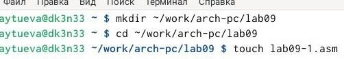{ #fig:001 width=70% }

В качестве примера рассмотрим программу вычисления арифметического выражения f(x) = 2x + 7 с помощью подпрограммы _calcul. В данном примере x вводится с клавиатуры, а само выражение вычисляется в подпрограмме. Вводим в файл lab09-1.asm текст программы из листинга 9.1. (рис. [-@fig:002]).

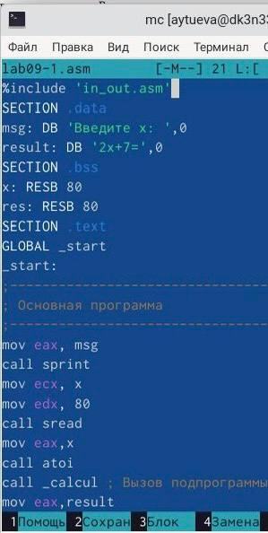{ #fig:002 width=70% }

Создаем исполняемый файл программы и запускаем его (рис. [-@fig:003]).

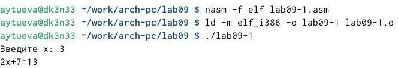{ #fig:003 width=70% }

Изменим текст программы, добавив подпрограмму _subcalcul в подпрограмму _calcul, для вычисления выражения f(g(x)), где x вводится с клавиатуры, f(x) = 2x + 7, g(x) = 3x - 1. (рис. [-@fig:004]). 

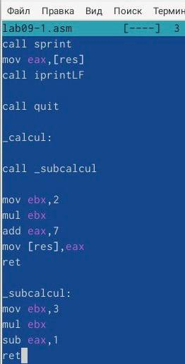{ #fig:004 width=70% }

Создаем новый исполняемый файл программы и запускаем его (рис. [-@fig:005]). 

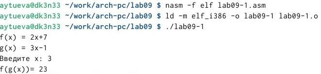{ #fig:005 width=70% }

Создаем файл lab09-2.asm. Вводим в него программу из листинга 9.2. (рис. [-@fig:006]).

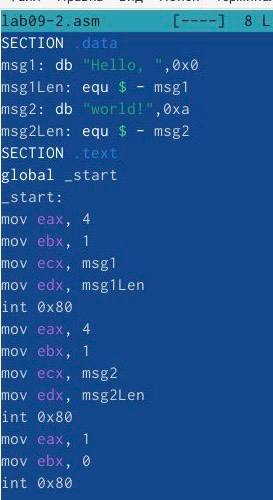{ #fig:006 width=70% }

Транслируем текст программы с ключом '-g'. Загружаем исполняемый файл в gdb (рис. [-@fig:007]).

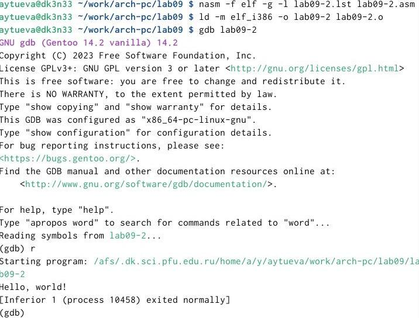{ #fig:007 width=70% }

Для более подробного анализа программы установим брейкпойнт на метку _start, с которой начинается выполнение любой ассемблерной программы, и запустим её. (рис. [-@fig:008]).

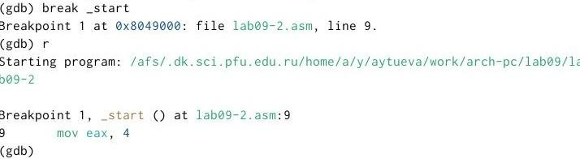{ #fig:008 width=70% }

Посмотрим дисассимилированный код программы с помощью команды disassemble начиная с метки _start. (рис. [-@fig:009]).

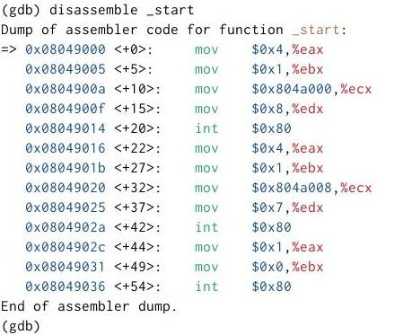{ #fig:009 width=70% }

Переключимся на отображение команд с Intel’овским синтаксисом, введя команду set disassembly-flavor intel. Различия между синтаксисом ATT и Intel заключаются в порядке операндов(ATT - Операнд источника указан первым. Intel - Операнд назначения указан первым), их размере (ATT - pазмер операндов указывается явно с помощью суффиксов, непосредственные операнды предваряются символом $; Intel - Размер операндов неявно определяется контекстом, как ax, eax, непосредственные операнды пишутся напрямую), именах регистров(ATT - имена регистров предваряются символом %, Intel - имена регистров пишутся без префиксов). (рис. [-@fig:010]).

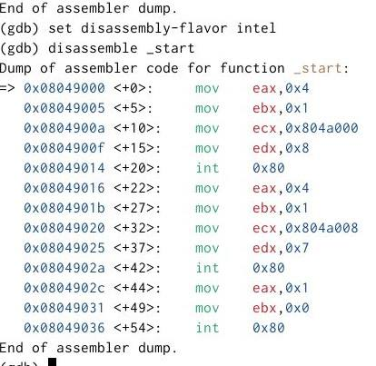{ #fig:010 width=70% }

Включим режим псевдографики для более удобного анализа программы. (рис. [-@fig:011]).

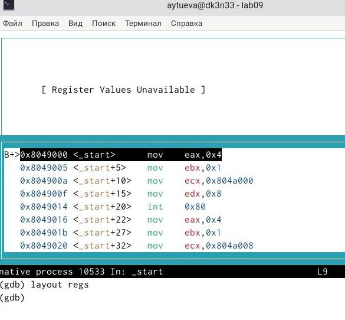{ #fig:011 width=70% }

Посмотрим наличие меток и добавим еще одну метку на предпоследнюю инструкцию. (рис. [-@fig:012]).

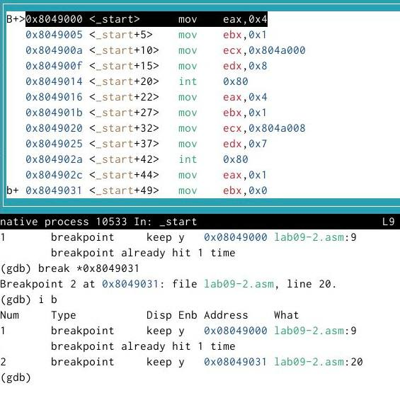{ #fig:012 width=70% }

С помощью команды посмотрим значение переменной msg1. (рис. [-@fig:013]).

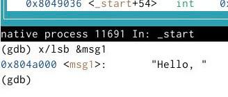{ #fig:013 width=70% }

Посмотрим значение второй переменной msg2. (рис. [-@fig:014]).

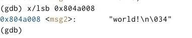{ #fig:014 width=70% }

С помощью команды set изменим значение переменной msg1. (рис. [-@fig:015]). 

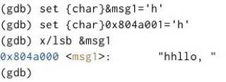{ #fig:015 width=70% }

Изменим переменную msg2. (рис. [-@fig:016]).

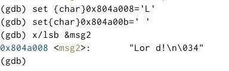{ #fig:016 width=70% }

Выведем в различных форматах (в шестнадцатеричном формате, в двоичном формате и в символьном виде) значение регистра edx.(рис. [-@fig:017]).

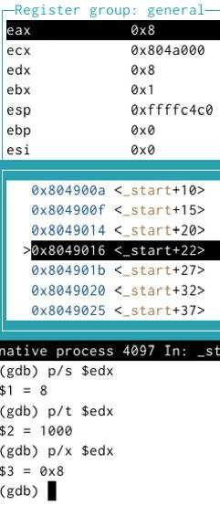{ #fig:017 width=70% }

Скопируем файл lab8-2.asm в файл с именем lab09-3.asm. Создадим исполняемый файл. Загрузим исполняемый файл в отладчик, указав аргументы. (рис. [-@fig:018]).

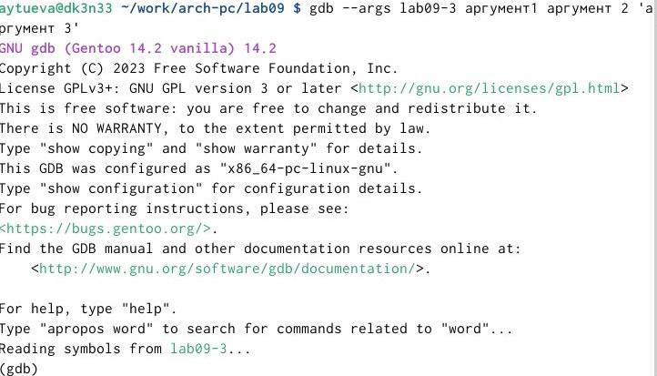{ #fig:018 width=70% }

Поставим метку на _start и запустим файл. (рис. [-@fig:019]).

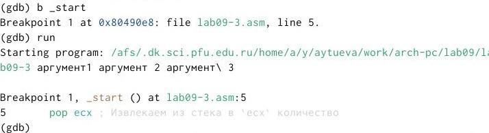{ #fig:019 width=70% }

Проверим адрес вершины стека и убедимся, что там хранится 5 элементов. (рис. [-@fig:020]). 

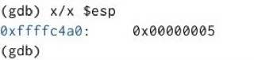{ #fig:020 width=70% }

Посмотрим остальные позиции стека – по адесу [esp+4] располагается адрес в памяти где находится имя программы, по адесу [esp+8] храниться адрес первого аргумента, по адресу [esp+12] – второго и т.д. Шаг изменения адреса равен 4 байтам, потому что мы работаем с 32-битной системой (x86), а указатели (void **) в такой системе занимают 4 байта. Ошибка Cannot access memory at address 0x0 на $esp + 24 указывает на то, что закончились аргументы командной строки. (рис. [-@fig:021]).

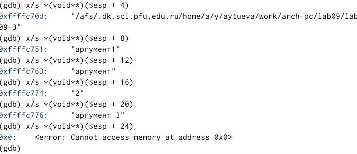{ #fig:021 width=70% }

# Выполнение самостоятельной работы

Преобразем программу из лабораторной работы №8 (Задание №1 для самостоятельной работы), реализовав вычисление значения функции f(x) как подпрограмму.(рис. [-@fig:022]).

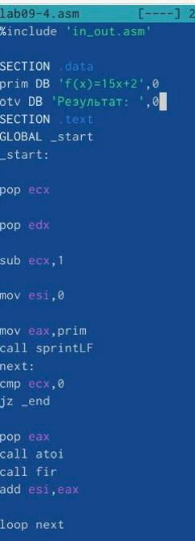{ #fig:022 width=70% }

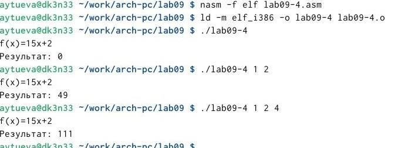{ #fig:023 width=70% }

Перепишем программу и попробуем запустить ее, чтобы увидеть ошибку. Ошибка арифметическая, так как вместо 25,программа выводит 10. (рис. [-@fig:024]).

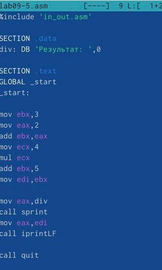{ #fig:024 width=70% }

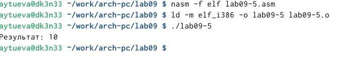{ #fig:025 width=70% }

После появления ошибки, я запустила программу в отладчике. (рис. [-@fig:026]).

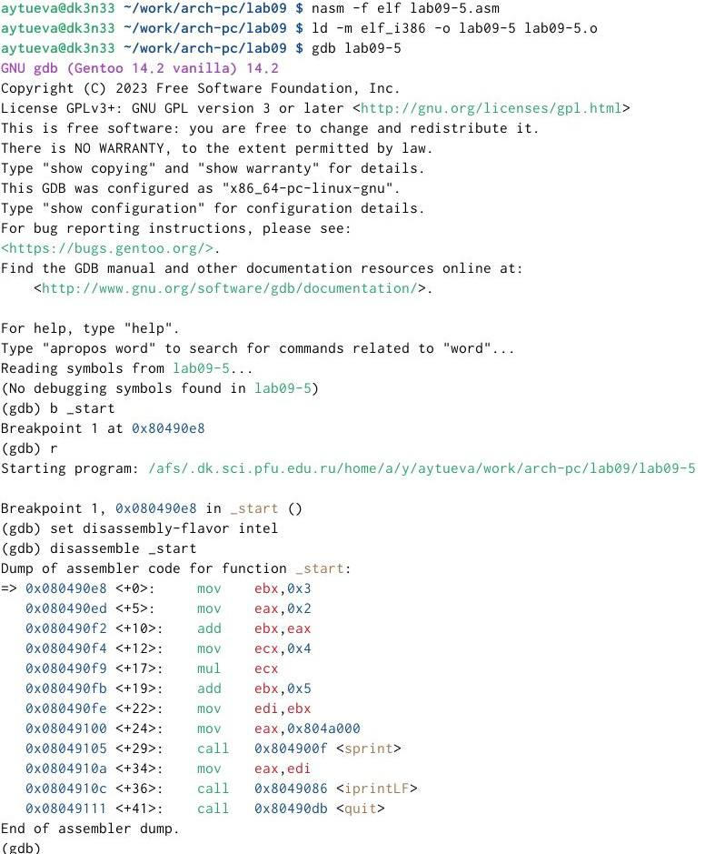{ #fig:026 width=70% }

Откроем регистры и проанализируем их. Некоторые регистры стоят не на своих местах. Исправим это. Изменим регистры и запустим программу. Программа вывела ответ 25, то есть все работает правильно.(рис. [-@fig:028]).

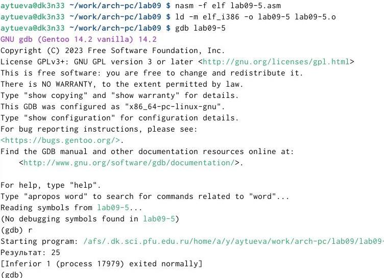{ #fig:028 width=70% }

# Выводы

В результате выполнения лабораторной работы я приобрела навыки написания программ с использованием циклов и обработкой аргументов командной строки в NASM.
